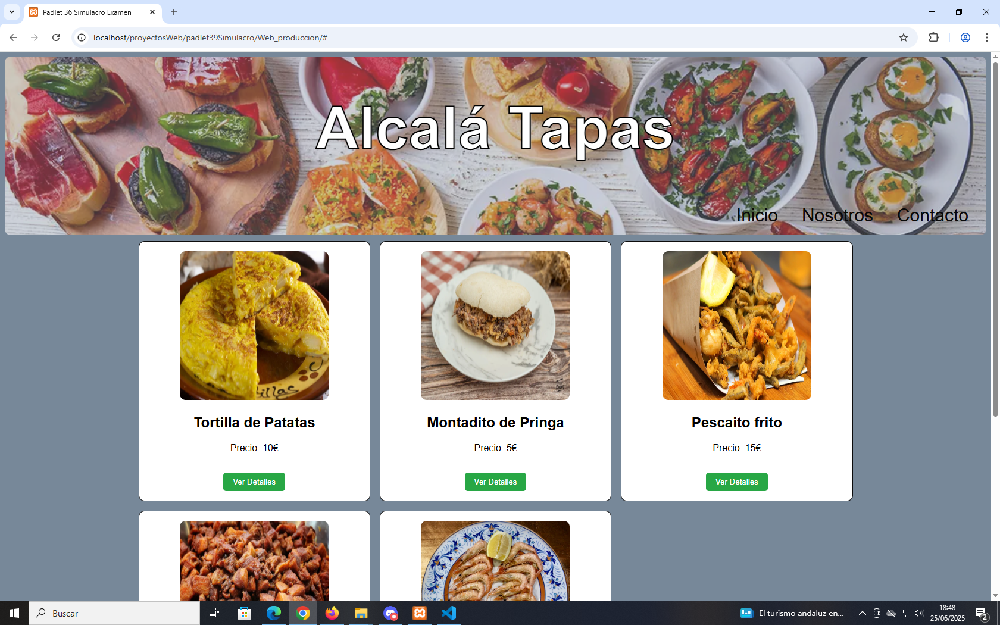

# 
Bar de Tapas Alcalá
:smirk:

En este proyecto, lo que hemos hecho es un **SIMULACRO DE EXAMEN**, donde hemos creado una web de un bar de tapas, en el cual hemos utilizado las siguientes tecnologias:

**1 HTML**
**2 CSS**
**3 JavaScript**
**4 PHP**
**5 Servidor Xampp**
**6 BBDD en MySQL**

